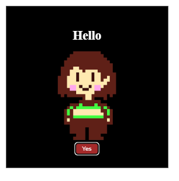
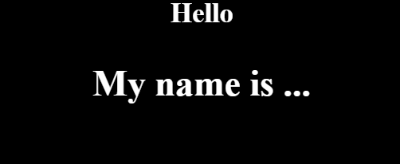
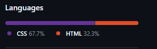

This is second commit index.html. 
It represents chara(undertale character) in the black box with greeting text and 'Yes' button. 
If you hover ur mouse on the card it will expand in scale. 

this is third commit index2.html on a different branch. 
It shows Hello, My Name is ... text in a row. 
It also has hover effect with changing font-family, scale and background color to grey.

This is my first repositorium!

Also this interesting detail: 